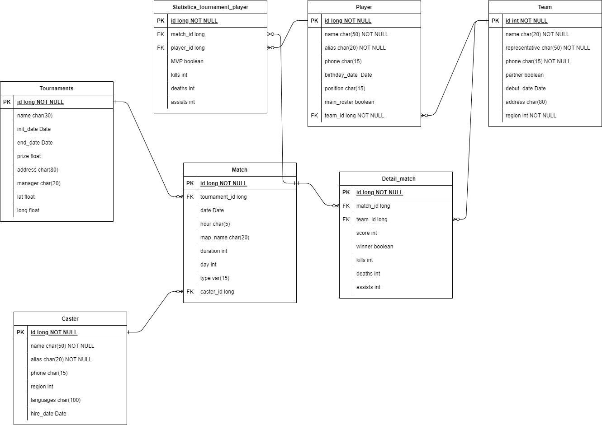

## Configuración de la base de datos

### Docker   
  - Crear la imagen:  
  ~~~
    docker build -t my-mariadb .  
  ~~~
  - Crear el contenedor:  
  ~~~
    docker run -d --name mariadb_container -p 3307:3306 my-mariadb 
  ~~~
El contenedor está corriendo en el puerto 3307 para que no entre en conflicto con MariaDb en local.  
  
Para entrar en el contenedor y realizar consultas directamente a la base de datos:  
  ~~~  
    docker exec -it mariadb_container my-mariadb -u mainuser -p
  ~~~
***

### Local
   Si ya está instalado Mariadb en el equipo y se quiere ejecutar en local  
  - Cambiar el puerto en el fichero **application.properties** 
~~~  
spring.datasource.url=jdbc:mariadb://localhost:3306/esports  
~~~
Poner de nuevo el puerto 3306 o el que corresponda a Mariadb en local 

Para realizar consultas directamente a la base de datos, se puede conectar directamente si se tiene instalado la consola de Mariadb o bien desde la consola de comandos con:  
~~~  
mysql -u mainuser -p -h localhost -P 3306
~~~  
  
## Diagrama Entidad-Relación  
  
  
  
## Arrancar el proyecto  

~~~  
  mvn spring-boot:run
~~~    

La primera vez se instalarán todas las dependencias especificadas en el pom.xml  
Si alguna dependencia no se ha instalado bien o algo no funciona correctamente con este comando se fuerza a recompilar:  

~~~  
  mvn clean install
~~~ 

## Poblar la base de datos  
  
En el primer arranque se poblará la base de datos con varios registros para cada tabla, no volvera a hacerlo si detecta que la tabla contiene registros  
Si se necesita forzar que las pueble de nuevo, cambiando en **application.properties** la configuración de arranque de la base de datos de esta manera:  
~~~  
spring.jpa.hibernate.ddl-auto=create-drop
~~~    
Se forzará a que al arrancar borre las tablas y las vuelva a crear  
Volver a poner la configuración inicial:
~~~  
spring.jpa.hibernate.ddl-auto=update
~~~    
  
Se ha añadido un registro a cada tabla expresamente para probar la función **DELETE**, está marcado en el registro como 'TO DELETE' siempre que el tipo de campo lo permita  

## Segurizar la API  
  
Usa token JWT con certificados.  
Todas las operaciones de la API necesitan token menos **/register** y **/login**  
Para obtener el token es necesarío loguearse con un usuario válido.  
  
Generar los certificados en la carpeta **/cert** en el root del proyecto, fuera de **/src**:  

 Crear un par de claves rsa (keypair.pem)  
`openssl genrsa -out private_key.pem 2048`  

Crear un certificado público (app.pub)  
`openssl rsa -in keypair.pem -pubout -out app.pub`  

Crear un certificado privado (app.key)  
`openssl pkcs8 -topk8 -inform PEM -outform PEM -nocrypt -in keypair.pem -out app.key`

## Mock API  
  
En el directorio **/mockapi** está hecha la mock API con **Wiremock** para testear.  
Para ponerla en marcha ejecutar este comando dentro del directorio /mockapi:  

`java -jar /mockapi/wiremock-standalone-3.13.0.jar --port 8085`

## NewMan (Con colección de Postman)  
  
Runner para ejecutar desde consola y generar informes de los resultados de los test de la colección de Postman.  
Los test de Postman están preparados para que funcionen con los resultados del entorno Mockapi.  
  
1. Instalar Newman (Es necesario tener instalado Node)  
` npm install -g newman `
2.  Instalar para poder ver los reportes de NewMan en html  
    `npm i newman-reporter-htmlextra`
3. Ejecutar donde están los archivos json de la colección y del entorno Mockapi  
  ` newman run Tournament_API.postman_collection.json -e MockApi.postman_environment.json -r htmlextra `  
El archivo con el informe en html se creará en el directorio /collections/test/newman

